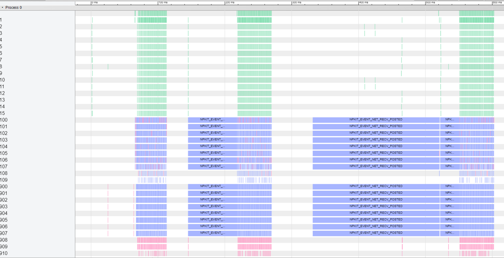

## Introduction

NPKit (Networking Profiling Kit) is a profiling framework designed for popular collective communication libraries (CCLs), including [Microsoft MSCCL](https://github.com/Azure/msccl/), [Microsoft MSCCL++](https://github.com/microsoft/mscclpp/), [NVIDIA NCCL](https://github.com/NVIDIA/nccl) and [AMD RCCL](https://github.com/ROCmSoftwarePlatform/rccl/). It enables users to insert customized profiling events into different CCL components, especially into giant GPU kernels. These events are then automatically placed onto a unified timeline in [Google Trace Event Format](https://docs.google.com/document/d/1CvAClvFfyA5R-PhYUmn5OOQtYMH4h6I0nSsKchNAySU/preview), which users can then leverage trace viewer to understand CCLs' workflow and performance.

NPKit is easy to use. It runs with all kinds of workloads where CCLs are leveraged. Users only need to dynamically link their workload binary to CCLs built with NPKit enabled, then the unified timeline with profiling events are automatically generated.

NPKit is lightweight. During each run, users can choose to only enable profiling events they care about to minimize overhead caused by NPKit.

Below is an example of NPKit timeline result. Green blocks are LL128 data transfer times in GPU, and each line represents a independent data flow (typically mapped to a channel or thread block). Red/purple blocks are net send/recv times in CPU. Each block contains other attributes, including data size, channel ID, etc.

## Quick Start

Please check `msccl_samples` for MSCCL quick start, `mscclpp_samples` for MSCCL++ quick start, `nccl_samples` for NCCL quick start and `rccl_samples` for RCCL quick start.

## Trademarks

This project may contain trademarks or logos for projects, products, or services.
Authorized use of Microsoft trademarks or logos is subject to and must follow [Microsoft's Trademark & Brand Guidelines](https://www.microsoft.com/en-us/legal/intellectualproperty/trademarks/usage/general).
Use of Microsoft trademarks or logos in modified versions of this project must not cause confusion or imply Microsoft sponsorship.
Any use of third-party trademarks or logos are subject to those third-party's policies.
